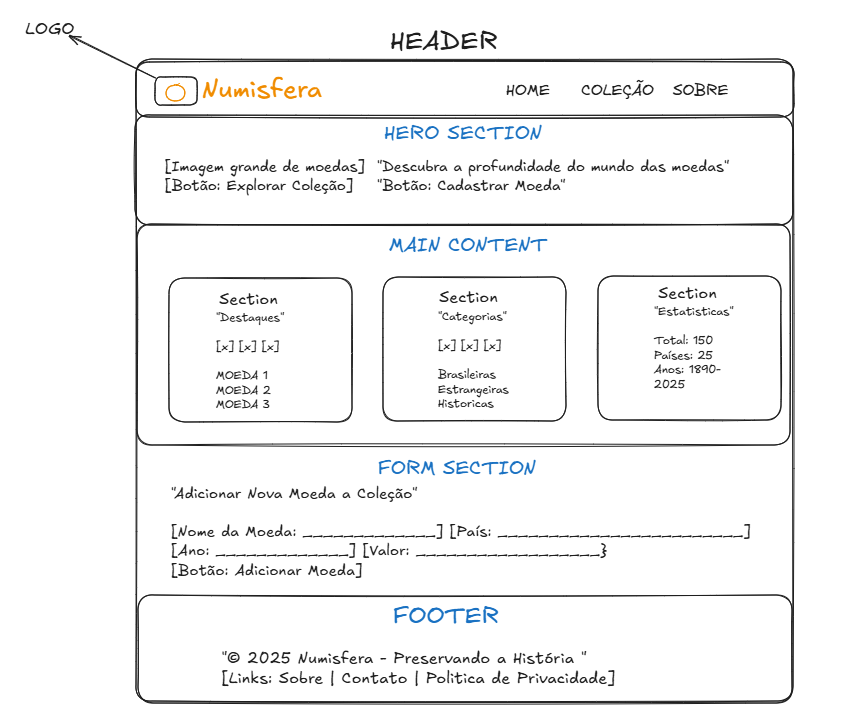
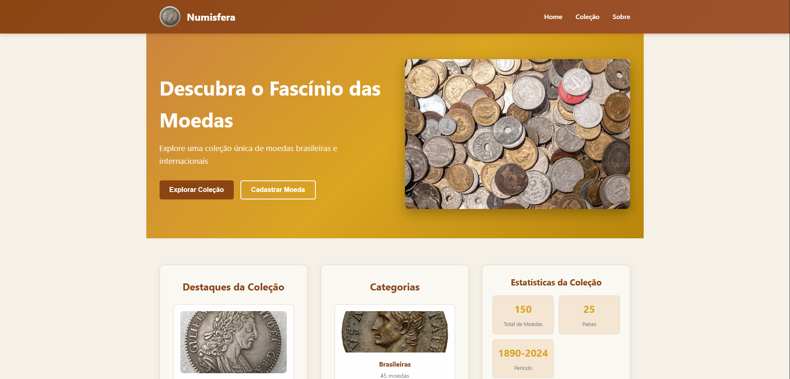

**Nome:** Vitor Ibraim de Paula Reis  
**Matrícula:** 903881  

## Proposta de Projeto Escolhida

**Proposta 4: Coleções e Itens**
- **Entidade Principal:** Coleção de Moedas
- **Entidade Secundária:** Item (Moeda)

## Descrição do Projeto

O **Numisfera** é um site dedicado à coleção e catalogação de moedas brasileiras e internacionais. O projeto oferece uma plataforma moderna e elegante para entusiastas da numismática explorarem, organizarem e aprenderem sobre moedas históricas.

## Wireframe do Projeto

## Screenatus

it

